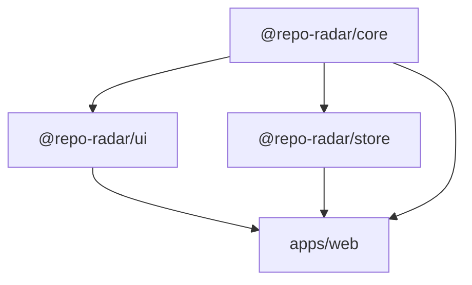

# Repo Radar

A dashboard to **search GitHub repositories, track your favourites, and monitor their latest stats** — stars, open issues, and last commit — with per-repo refresh, a stars comparison chart, and localStorage persistence.

**Live demo:** _(Vercel URL — see Deployment)_

> React 19 · TypeScript · Redux Toolkit + RTK Query · MUI · Vite · Turborepo + pnpm · Vitest · Storybook · Vercel

---

## Table of contents

- [Features](#features)
- [Getting started](#getting-started)
- [Monorepo structure](#monorepo-structure)
- [Architecture & technical decisions](#architecture--technical-decisions)
- [GitHub API rate limits](#github-api-rate-limits)
- [Testing](#testing)
- [Deployment](#deployment)
- [Assumptions & limitations](#assumptions--limitations)
- [Possible next steps](#possible-next-steps)

---

## Features

| Requirement                           | Implementation                                                                                                                                                                         |
| ------------------------------------- | -------------------------------------------------------------------------------------------------------------------------------------------------------------------------------------- |
| Debounced repository search           | `useDebouncedValue` (400 ms) feeding an RTK Query hook; requests are skipped for queries under 2 chars. Numbered pagination (12 per page) with the query and page mirrored in the URL. |
| Track / untrack repositories          | `trackedRepos` slice built on `createEntityAdapter`; toggle from search results or the tracked view.                                                                                   |
| Tracked repos view                    | `/tracked` route with a stars chart, per-repo cards, and a "Refresh all" action.                                                                                                       |
| Stars, open issues, last commit date  | Rendered from the `Repo` domain model; relative dates via `Intl.RelativeTimeFormat`, absolute date in tooltip.                                                                         |
| Refresh individual and/or all repos   | Per-card `refetch()`; "Refresh all" is a thunk that refetches sequentially with a stagger and stops early if the rate limit is exhausted.                                              |
| Independent loading/error per repo    | Each card calls `useGetRepoQuery(fullName)` — RTK Query keeps one cache entry per argument, so `isLoading` / `isFetching` / `error` are naturally isolated.                            |
| Persist tracked repos in localStorage | Listener middleware persists on every relevant action; a versioned envelope + runtime type guards validate data on rehydration.                                                        |
| Proper TypeScript types               | `strict` + `noUncheckedIndexedAccess`; raw GitHub DTOs are mapped to a domain model at the API boundary so UI code never sees snake_case.                                              |
| Bar chart of stars per tracked repo   | `@mui/x-charts` horizontal bar chart, fed directly from the RTK Query cache (no extra requests).                                                                                       |
| _Extras_                              | Dark/light theme (persisted), live API-budget indicator, optional personal access token, Storybook, unit + integration tests, CI, code-splitting per route.                            |

---

## Getting started

**Prerequisites:** Node ≥ 20 (see `.nvmrc`) and pnpm 9. If you have Corepack, `corepack enable` will pick up the pinned pnpm version automatically.

```bash
pnpm install
pnpm dev             # Vite dev server → http://localhost:5173
```

Other scripts (run from the repo root; Turborepo fans them out to every package):

```bash
pnpm build           # build all packages + the web app
pnpm test            # Vitest across all packages
pnpm lint            # ESLint (flat config)
pnpm typecheck       # tsc --noEmit in every package
pnpm format:check    # Prettier
pnpm storybook       # component explorer for @repo-radar/ui → http://localhost:6006
```

No environment variables are required. The app works unauthenticated out of the box; a GitHub token can optionally be added in-app (see [rate limits](#github-api-rate-limits)).

---

## Monorepo structure

```
repo-radar/
├── apps/
│   └── web/                     # Vite + React 19 SPA (routing, providers, feature composition)
├── packages/
│   ├── core/                    # Framework-agnostic: domain types, DTO mappers, formatting, storage, guards
│   ├── store/                   # Data layer: RTK Query API, slices, persistence, thunks, typed hooks
│   ├── ui/                      # Presentational MUI component library + theme + Storybook
│   ├── eslint-config/           # Shared ESLint flat configs (base, react)
│   └── typescript-config/       # Shared tsconfig bases (base, react-library, vite-app)
├── turbo.json                   # Task graph + caching
├── pnpm-workspace.yaml
└── vercel.json                  # Monorepo-aware build + SPA rewrites + security headers
```

**Dependency graph** (strictly acyclic):



| Package | Owns                                                                                                                                                                                | Must **not** know about                        |
| ------- | ----------------------------------------------------------------------------------------------------------------------------------------------------------------------------------- | ---------------------------------------------- |
| `core`  | `Repo`, `TrackedRepo`, `RateLimitInfo` types; GitHub DTOs + mappers; `Intl` formatters; versioned storage helpers; runtime type guards                                              | React, Redux, MUI                              |
| `store` | `githubApi` (RTK Query), `trackedRepos` / `auth` / `settings` / `rateLimit` slices, persistence middleware, `refreshAllTrackedRepos` thunk, `createAppStore`, typed hooks/selectors | UI components, routing                         |
| `ui`    | Stateless MUI components (`RepoCard`, `SearchBar`, `StarsBarChart`, `RateLimitIndicator`, …), theme factory, Storybook                                                              | Redux, fetching — everything arrives via props |
| `web`   | Routes, providers, and thin **feature** components that wire `store` hooks into `ui` components                                                                                     | Raw GitHub response shapes                     |

Internal packages are consumed as TypeScript source (`exports: "./src/index.ts"`), so there is no build step for libraries during development and Vite tree-shakes across package boundaries. Turborepo caches `lint` / `typecheck` / `test` / `build` per package.

---

## Architecture & technical decisions

### State & data layer: Redux Toolkit + RTK Query

RTK Query was chosen over Zustand or hand-rolled thunks because the requirements map almost 1:1 onto what it gives for free:

- **Independent loading/error state per repo** — each `TrackedRepoCard` calls `useGetRepoQuery(fullName)`. RTK Query keys cache entries by argument, so every card owns its own `isLoading`, `isFetching`, `error`, and `refetch()` with zero custom bookkeeping.
- **Refresh individual repos** — `refetch()` on the card's own hook.
- **Refresh all** — `refreshAllTrackedRepos` thunk iterates tracked repos and dispatches `getRepo.initiate(name, { forceRefetch: true })` **sequentially with a 150 ms stagger**, so a large list doesn't burst the GitHub rate limit, and it **bails early** if the budget hits zero (remaining cards keep their cached data).
- **Deduplication and caching** — navigating between Search and Tracked reuses cached data (`keepUnusedDataFor: 300`), and the stars chart selects directly from the cache instead of fetching again.
- **Pagination** — each `{ query, page }` pair is its own cache entry, so previously visited pages are instant. The hook's `data` (last successful result) keeps the current page visible while the next loads, and `currentData` drives a subtle dimmed state. The active query and page live in the URL (`/?q=react&page=3`), so refresh, back/forward and sharing all preserve the view.

Client state that isn't server-derived lives in ordinary slices:

- `trackedRepos` — `createEntityAdapter` for O(1) lookups (`selectIsTracked`) and stable ordering. Only **identity fields** are stored (`id`, `fullName`, `url`, `trackedAt`); live stats are always fetched, never persisted, so the UI can't show stale-but-confident numbers.
- `auth` — optional user token. `settings` — theme mode. `rateLimit` — per-resource budget parsed from response headers.

### Boundary between raw API and domain model

`packages/core` defines both the **GitHub DTOs** (`GitHubRepoDto`, snake_case) and the **domain model** (`Repo`, camelCase, only the fields we use). Mapping happens once, in `transformResponse`, so UI code, tests, and Storybook stories all work with the domain type. Swapping the data source (e.g. GraphQL, a BFF) touches only the `store` package.

### Error handling

A custom `baseQuery` wraps `fetchBaseQuery` and normalises every failure into a typed `ApiError { kind: 'rate-limit' | 'not-found' | 'unauthorized' | 'network' | 'unknown', status, message, resetAt }`. GitHub returns rate-limit failures as **403** with a message, not just 429, so the classifier checks both. The `web` app maps `ApiError` → human copy in one place (`toUserMessage`). Cards show errors **inline** next to any stale data they still have, never as a global toast.

### Persistence

A `createListenerMiddleware` instance listens for tracking/auth/theme actions and writes to storage. Data is wrapped in `{ version, data }` and validated on load with runtime type guards; anything that fails validation is discarded rather than crashing the app. Storage is injected (`StorageAdapter`), which makes persistence unit-testable with an in-memory adapter.

### UI package

Components in `@repo-radar/ui` are strictly presentational and typed against `core` — e.g. `RepoCard` takes `repo`, `isLoading`, `isRefreshing`, `errorMessage`, and callbacks. This keeps them reusable, trivially testable with React Testing Library, and documentable in Storybook (every state — default, loading, refreshing, error, stale-with-error — is a story). MUI theming is centralised in `createAppTheme(mode)`.

### Responsive design

Layout is mobile-first and verified at 320 px (iPhone SE), 390 px, 412 px, 768 px, 1024 px and 1440 px:

- **Navigation adapts to the platform convention** — header tabs at `md+`; on phones and small tablets the primary destinations move to a fixed **bottom navigation bar** (Material's recommendation for 2–5 top-level destinations), with the tracked count as a badge. Content gets bottom padding plus `env(safe-area-inset-bottom)` so nothing hides behind the bar or the iOS home indicator.
- **Header actions compress** — the API budget chip drops its text prefix below `sm`, and below 360 px the app title becomes screen-reader-only so the toolbar never overflows.
- **Pagination is responsive** — `large` size with first/last buttons and one sibling on desktop; `medium`, no siblings, no first/last on phones, stacked above a "Showing X–Y of Z" caption.
- **Chart adapts** — the horizontal bar chart drops the owner prefix from labels, tightens margins and reduces axis ticks on phones; height scales with the number of tracked repos.
- **Cards are uniform** — `width: 100%` / `height: 100%`, fixed two-line description and an always-present footer, so a grid of mixed content still reads as one system. Columns: 1 → 2 → 3 across `xs` → `sm` → `lg`.
- Dialogs go full-screen below `sm`.

### Performance

- Route-level code splitting (`React.lazy`) — the 300 kB charts bundle is only downloaded when visiting **Tracked**.
- Debounced search + minimum query length + RTK Query dedup keep API traffic minimal.
- The chart's selector uses a custom equality function so it re-renders only when a star count actually changes.
- Browser `ETag` revalidation means repeated fetches of unchanged repos often return `304`, which GitHub **doesn't count** against the rate limit.

### Tooling

- **Turborepo + pnpm** — fast, cached task graph; workspace protocol for internal deps.
- **Shared ESLint / tsconfig packages** — one place to change rules.
- **Vitest** everywhere, **MSW** for request-level mocking (no mocking of hooks or fetch internals).
- **CI** (`.github/workflows/ci.yml`) runs format → lint → typecheck → test → build → Storybook build on every push/PR.

---

## GitHub API rate limits

Unauthenticated GitHub REST access allows **60 core requests/hour** and **10 searches/minute** per IP — easy to exhaust with a dashboard. The approach here:

1. **Never ship a token in the bundle.** Anything in a `VITE_*` env var is public in the browser. There is intentionally no build-time token.
2. **Be frugal by default** — debounce, minimum query length, RTK Query caching/dedup, sequential staggered refresh-all, and ETag revalidation.
3. **Make the budget visible** — every response's `x-ratelimit-*` headers are parsed into the `rateLimit` slice and shown in the header badge (`API 57/60`), turning amber under 20 % and switching to a reset countdown at zero.
4. **Fail gracefully** — rate-limit errors are classified, shown inline with the reset time, and retry buttons are disabled until the window resets.
5. **Optional personal access token (opt-in, per user)** — the key icon opens a dialog where a user can paste a fine-grained PAT (no scopes required) to raise their own limit to 5,000/hour. It's stored in _their_ browser's localStorage and sent only to `api.github.com`.

**Production path (not built, by design):** for a shared, multi-user deployment the right move is a small **serverless BFF** (e.g. a Vercel function) that injects a server-side token from an environment variable and proxies `api.github.com`. That keeps the secret off the client and gives every visitor the higher limit. Because the data layer is isolated in `@repo-radar/store`, switching to it would be a one-line `baseUrl` change.

---

## Testing

```bash
pnpm test
```

| Package | Tests | What's covered                                                                                                                                                                                                                                                                                              |
| ------- | ----- | ----------------------------------------------------------------------------------------------------------------------------------------------------------------------------------------------------------------------------------------------------------------------------------------------------------- |
| `core`  | 20    | Formatters (compact numbers, relative dates, countdown), versioned storage (round-trip, version mismatch, corrupt JSON, quota errors), DTO→domain mappers, type guards                                                                                                                                      |
| `store` | 26    | Slice reducers, rate-limit header parsing (incl. search vs core buckets), `ApiError` classification (403 vs 429, 404, 401, network), RTK Query endpoints via **MSW** (mapping, bearer token injection, paging params, rate-limit capture), persistence rehydration, refresh-all sequencing + early bail-out |
| `ui`    | 13    | `RepoCard` states (data, skeleton, stale-while-refreshing, error+retry, track toggle a11y), `SearchBar`, `RateLimitIndicator`, `TokenDialog`                                                                                                                                                                |
| `web`   | 6     | `useDebouncedValue`; **integration tests** with MSW: debounce → single request, search → track → tracked view → live stats → chart → localStorage, isolated per-repo error, single-repo refresh, rate-limit UX                                                                                              |

---

## Deployment

The app is deployed on Vercel from the root of the monorepo. `vercel.json` configures:

- `installCommand: pnpm install --frozen-lockfile`
- `buildCommand: pnpm turbo run build --filter=@repo-radar/web`
- `outputDirectory: apps/web/dist`
- SPA rewrite to `index.html`, immutable caching for hashed assets, and security headers (CSP restricted to `api.github.com` + GitHub avatars, `X-Frame-Options: DENY`, etc.)

To deploy your own: import the repo in Vercel, leave **Root Directory** as the repository root, and Vercel will pick up `vercel.json`. No environment variables are needed.

---

## Assumptions & limitations

- **"Last commit date" uses `pushed_at`** from the repository object rather than the commits endpoint. It reflects the last push to any branch and avoids one extra request per repo per refresh. Documented in the UI tooltip as "Last commit".
- **Search is capped by GitHub at 1,000 results** and sorted by stars; the pagination control therefore never exceeds 84 pages and the results line says "showing the top 1,000" when the true count is higher.
- **Token storage** — a user-supplied PAT lives in localStorage, which is appropriate for a personal tool but is not how secrets would be handled in a shared production product (see the BFF note above).
- **Rate-limit badge** shows the **core** bucket (the one that governs tracked-repo fetches). Until the first core request it falls back to the search bucket.
- **Sorting** of tracked repos is by "most recently tracked"; there is no drag-reorder or custom sort.
- **No E2E browser tests** — the integration tests run in jsdom with MSW; a Playwright smoke test would be the natural next addition.

---

## Possible next steps

- Serverless BFF proxy with a server-side token (see above).
- Additional charts (open issues, forks, stars-over-time using the stargazers endpoint).
- Notes/tags on tracked repos, import/export of the tracked list.
- Playwright E2E on the deployed preview URL in CI.
- Virtualised list for very large tracked sets.
