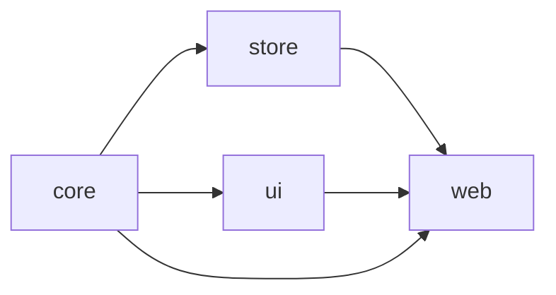

# Repo Radar

Search GitHub repositories, track the ones you care about, and monitor their stars, open issues and last commit — with per-repo refresh, a stars chart and localStorage persistence.

**Live demo:** _add Vercel URL here_

React 19 · TypeScript · Redux Toolkit + RTK Query · MUI · Vite · Turborepo + pnpm · Vitest + MSW · Storybook · Vercel

---

## 1. Setup

**Prerequisites:** Node ≥ 20 (`.nvmrc`) and pnpm 9 (`corepack enable` picks up the pinned version).

```bash
pnpm install
pnpm dev          # → http://localhost:5173
```

| Command                                              | What it does                                             |
| ---------------------------------------------------- | -------------------------------------------------------- |
| `pnpm test`                                          | Vitest across all packages (70 tests)                    |
| `pnpm lint` / `pnpm typecheck` / `pnpm format:check` | ESLint · `tsc --noEmit` · Prettier                       |
| `pnpm build`                                         | Builds every package and the web app (`apps/web/dist`)   |
| `pnpm storybook`                                     | Component explorer for `@repo-radar/ui` → localhost:6006 |

No environment variables are needed. The app works unauthenticated; a GitHub token can optionally be added in-app (see §2.6).

**Deploy:** import the repo in Vercel with the repository root as _Root Directory_. `vercel.json` sets the pnpm install, the Turborepo build (`--filter=@repo-radar/web`), the output directory, the SPA rewrite and security headers (CSP limited to `api.github.com` + GitHub avatars). CI (`.github/workflows/ci.yml`) runs format → lint → typecheck → test → build → Storybook build on every push.

---

## 2. Architecture & technical decisions

### 2.1 Monorepo layout

```
apps/web                  Vite + React 19 SPA — routes, providers, feature composition
packages/core             Framework-agnostic: domain types, GitHub DTO mappers, formatters, storage, type guards
packages/store            Data layer: RTK Query API, slices, persistence middleware, thunks, typed hooks
packages/ui               Presentational MUI components + theme + Storybook (no Redux, no fetching)
packages/eslint-config    Shared flat ESLint configs
packages/typescript-config  Shared tsconfig bases
```



Dependencies form a strict DAG enforced by `package.json` (e.g. `ui` cannot import `store`), which keeps `ui` reusable and Storybook-able, and keeps raw GitHub shapes out of everything except `store`. Packages are consumed as TypeScript source (no library build step); Turborepo caches lint/typecheck/test/build per package.

### 2.2 State: Redux Toolkit + RTK Query

Server state (repo data) lives in RTK Query; client state (tracked list, token, theme, rate-limit budget) lives in plain slices.

- **Independent loading/error per repo for free** — each tracked card calls `useGetRepoQuery(fullName)`; RTK Query keys cache entries by argument, so `isLoading`, `isFetching`, `error` and `refetch()` are isolated per card with no custom bookkeeping.
- **Refresh all** — a thunk refetches tracked repos sequentially with a 150 ms stagger and stops early if the rate limit is exhausted (remaining cards keep cached data).
- **Search pagination** — numbered pages (12/page); each `{ query, page }` is its own cache entry so revisited pages are instant. `data` keeps the previous page on screen while the next loads; `currentData` drives a dimmed state. Query and page are mirrored in the URL (`/?q=react&page=3`) so refresh, back/forward and sharing preserve the view.
- **Tracked repos** — `createEntityAdapter` for O(1) `selectIsTracked`; only identity fields (`id`, `fullName`, `url`, …) are persisted — stats are always fetched, never stored, so the UI can't show stale-but-confident numbers.

### 2.3 API boundary

`core` holds both the GitHub DTOs (snake_case) and the domain model (`Repo`, camelCase, only fields we use). Mapping happens once in `transformResponse`, so UI, tests and stories never see raw API shapes; swapping the data source touches only `store`.

### 2.4 Errors

A custom `baseQuery` normalises failures into a typed `ApiError { kind: 'rate-limit' | 'not-found' | 'unauthorized' | 'network' | 'unknown', status, message, resetAt }`. GitHub signals rate limits as **403** with a message (not only 429), so both are classified. Errors render inline on the affected card next to any stale data — never as a global toast.

### 2.5 Persistence

`createListenerMiddleware` writes the tracked list, token and theme to localStorage on the relevant actions. Data is wrapped in `{ version, data }` and validated with runtime type guards on load; anything invalid is discarded rather than crashing. The storage adapter is injected, so persistence is unit-tested with an in-memory store.

### 2.6 GitHub rate limits (60 req/h unauthenticated)

1. **No token is ever shipped** — `VITE_*` values are public in the bundle, so there is intentionally none.
2. **Frugal by default** — debounce (400 ms), 2-char minimum, RTK Query dedup/caching (`keepUnusedDataFor: 300`) and staggered refresh-all keep request counts low.
3. **Visible budget** — `x-ratelimit-*` headers feed a header badge (`API 57/60`; amber under 20 %; reset countdown at zero). Retries are disabled while limited.
4. **Opt-in personal token** — a user can paste their own fine-grained PAT (stored only in their browser, sent only to `api.github.com`) to raise their limit to 5,000/h.

_Production path, not built by design:_ a serverless BFF proxy holding a server-side token would give every visitor the higher limit while keeping the secret off the client — a one-line `baseUrl` change given the isolated data layer.

### 2.7 UI & responsiveness

- `ui` components are strictly presentational (`RepoCard`, `SearchBar`, `StarsBarChart`, `RepoPagination`, `BottomNavBar`, …); every state is a Storybook story. Theming (light/dark, persisted) is one `createAppTheme(mode)` factory.
- Verified at 320 / 390 / 412 / 768 / 1024 / 1440 px. Header tabs at `md+`; below that, navigation moves to a fixed **bottom navigation bar** with safe-area padding. The budget chip drops its prefix below `sm`; the title becomes screen-reader-only below 360 px.
- Pagination is `large` with first/last on desktop; `medium`, no siblings, stacked beneath the "Showing X–Y of Z" caption on phones.
- Cards are uniform (`width/height: 100%`, fixed two-line description, always-present footer, ellipsised titles) in a 1 → 2 → 3 column grid. The chart shortens labels and reduces ticks on phones; dialogs go full-screen below `sm`.
- Routes are lazy-loaded, so the ~300 kB charts bundle downloads only on **Tracked**.

### 2.8 Testing

| Package | Tests | Focus                                                                                                                                                                             |
| ------- | ----- | --------------------------------------------------------------------------------------------------------------------------------------------------------------------------------- |
| `core`  | 20    | formatters, versioned storage (corrupt/mismatched data), DTO → domain mappers, type guards                                                                                        |
| `store` | 26    | reducers, rate-limit header parsing, `ApiError` classification, RTK Query endpoints via **MSW**, persistence rehydration, refresh-all sequencing and early bail-out               |
| `ui`    | 16    | `RepoCard` states, `SearchBar`, `RateLimitIndicator`, `TokenDialog`, `RepoPagination` (incl. a11y attributes)                                                                     |
| `web`   | 8     | integration with MSW: debounce → one request, pagination ↔ URL sync, search → track → tracked view → chart → localStorage, isolated per-repo error, single refresh, rate-limit UX |

---

## 3. Assumptions & limitations

- **"Last commit" uses `pushed_at`** from the repository object (last push to any branch) instead of an extra commits request per repo. Labelled "Last commit" in the tooltip.
- **GitHub caps search at 1,000 results**, so pagination stops at 84 pages and the results line says "showing the top 1,000" when more matched.
- **Personal tokens live in localStorage** — fine for a personal tool, not how secrets would be handled in a shared product (see the BFF note above).
- **Rate-limit badge shows the core bucket** (which governs tracked-repo fetches); until the first core request it falls back to the search bucket.
- **Tracked repos sort by most-recently-tracked**; no manual reordering.
- **No browser E2E tests** — integration tests run in jsdom with MSW. Playwright against the Vercel preview would be the natural next step, along with the BFF proxy, additional charts (issues/forks over time) and import/export of the tracked list.
